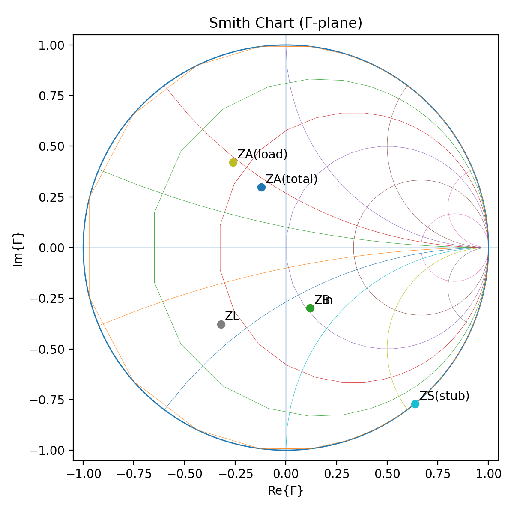
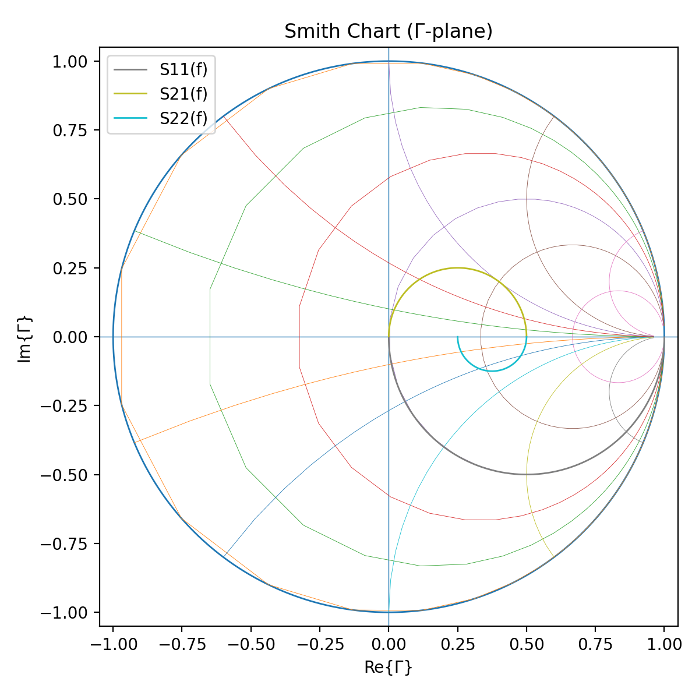
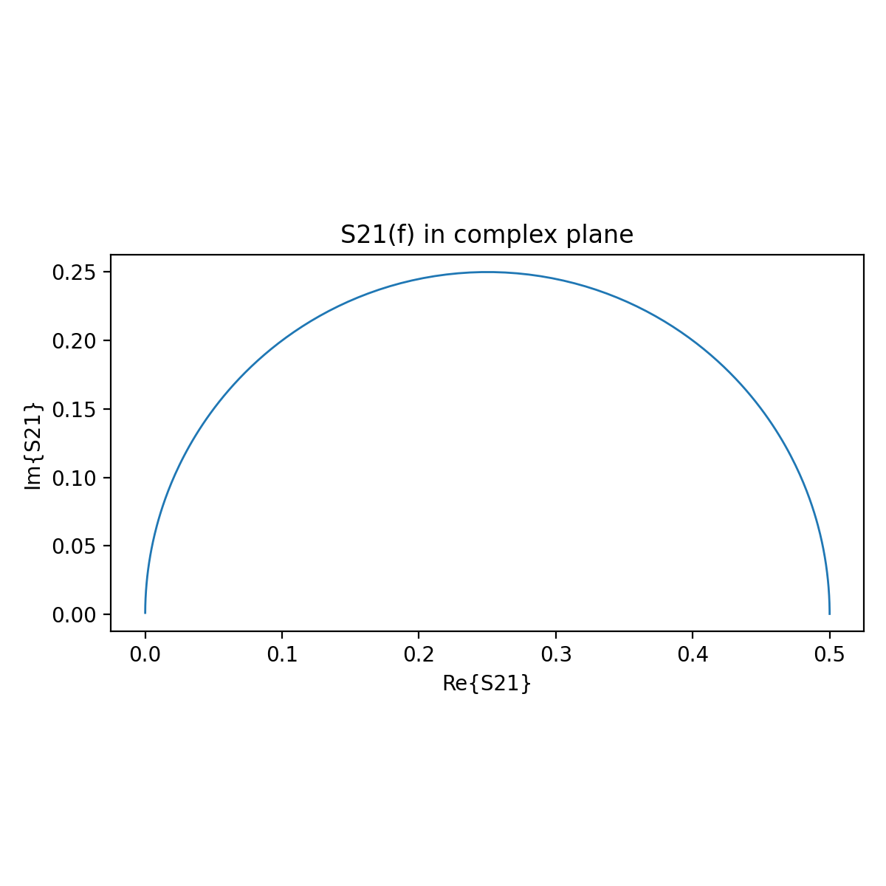
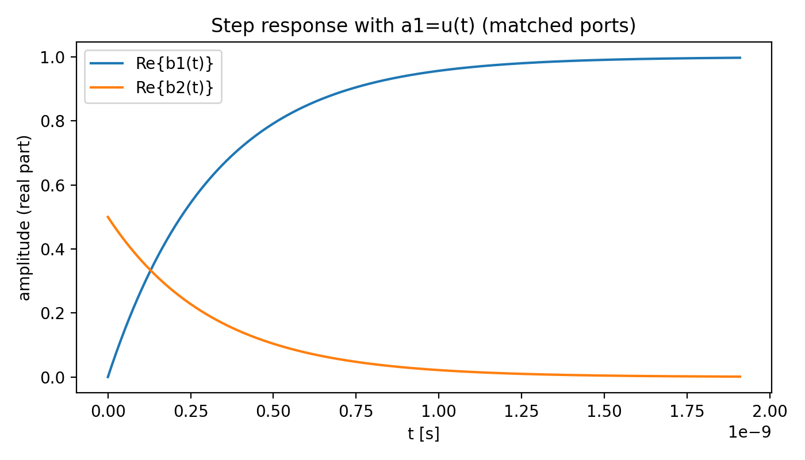
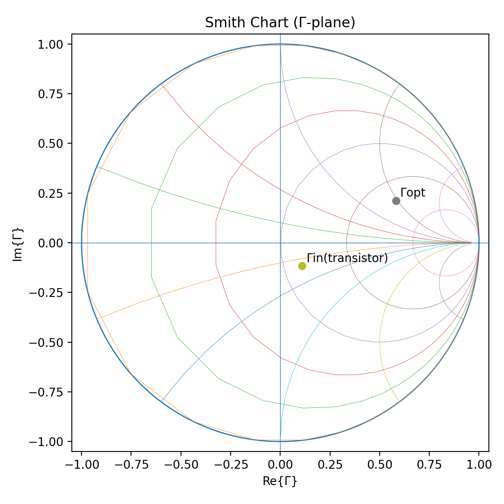

# ECE166 Microwave Toolkit

This repo is my “ECE 166 competency” project.  
I implemented the same method to solve ECE 166 style-problems (Smith chart / transmission lines, stubs, S-parameters, power waves, Friis noise figure, couplers/Wilkinson, and LNA matching/stability), but in a **parameterized Python script** that can be rerun with different values.

So it doesn't just work with the values given on the final, it’s a tool that can re-compute everything (numbers + plots) when you change the parameters of the network. Here, I used different values than the ones used on the FA24 final for my generations below for example except for question 4.

---

## What’s in here

- `ece166_competency_project_v2.py` — main script
- `ece166_outputs/` — output PNGs saved by the script

---

## What this covers (mapped to ECE 166 final-style questions)
Publicly available FA24 final problems: https://drive.google.com/file/d/1jnlbsgecS1p6mQNJiG0JsBlw5vfbag92/view

### 1) Transmission line + shunt stub + Smith chart points  
**(Fall 2024 Final — Problem 1 style)**  
The script computes and plots the key impedances you’d normally do by hand:

- Load reflection coefficient **ΓL**
- Transform along the line to get **ZA(load-only)**, then combine with a shunt stub to get **ZA(total)**
- Transform to **ZB** and **Zin**
- Compute delivered power from a chosen incident wave
- Find where the line looks purely resistive (Im{Z}=0)

(Printed to terminal)
```text
========================================================================
Problem 1-style: Transmission line + shunt stub computations
========================================================================
Z0(main) = 50.0 Ω
ZL       = 20.0 - j20.0 Ω
ΓL       = -0.3208 - j0.3774  |ΓL|=0.4953, ∠=-130.36°
At point A (from load only): ZA_load = 21.3822 + j23.8928 Ω
Stub: type=open, l_stub=0.07λ, ZS = 0.0 - j106.2554 Ω
Combined at A (shunt): ZA = 33.3402 + j22.1685 Ω
Point B: ZB = 51.9962 - j34.5732 Ω
Input:  Zin = 51.9962 - j34.5732 Ω
Γin      = 0.1206 - j0.2981  |Γin|=0.3216, ∠=-67.97°

Incident power (from V1+): P_inc = 1 W
Delivered into network:     P_del = 0.8966 W
Lossless assumption => Power to load: P_load = 0.8966 W

Purely-resistive points along the line segment from LOAD to A:
  l = 0.0689 λ : R ≈ 16.878 Ω  =>  V_R,pk ≈ 5.5014 V
```

**Plot:** `problem1_smith_points.png`  


---

### 2) 3-port S-parameters vs frequency + power balance + time constant  
**(Fall 2024 Final — Problem 2 style)**  
The script models a simple 3-port RC network and then:

- Computes the 3×3 **S-matrix** at a reference frequency
- Sweeps frequency and plots **S11(f)** and **S22(f)** on a Smith chart
- Plots **S21(f)** in the complex plane (extra visualization)
- Uses the power-wave method to compute “power consumed”:
  Σ|a|² − Σ|b|²
- Estimates a first-order time constant **τ** and plots the step response for **a1=u(t)**

(Printed to terminal)
```text
========================================================================
Problem 2-style: 3-port S-parameters vs frequency + time response
========================================================================
Z0 = 50.0 Ω, R = 50.0 Ω
Chosen C = 3.1831e-12 F (so that Xc=-Z0 at f_ref=1e+09 Hz)

S(f_ref) =
  [0.2 - j0.4, 0.4 + j0.2, 0.4 + j0.2]
  [0.4 + j0.2, 0.3 - j0.1, 0.3 - j0.1]
  [0.4 + j0.2, 0.3 - j0.1, 0.3 - j0.1]

For a1=1, a2=a3=0 (matched terminations):
  b = [0.2-0.4j 0.4+0.2j 0.4+0.2j]
  Σ|a|^2 = 1,  Σ|b|^2 = 0.6,  dissipated = 0.4

Time constant estimate (matched ports):
  Req_other_side = (R+Z0)/2 = 50 Ω
  Req_total      = Z0 + Req_other_side = 100 Ω
  tau = Req_total * C = 3.1831e-10 s
```

**Plots:**
- `problem2_s11_s22_smith.png`  
  
- `problem2_s21_complex.png`  
  
- `problem2_step_response.png`  
  

---

### 3) Friis gain + noise figure + output noise power  
**(Fall 2024 Final — Problem 3 style)**  
Given a chain (amp / attenuator / amp), the script computes:

- Total gain
- Total noise figure (Friis)
- Equivalent noise temperature
- Output noise power (kTB·G)

(Printed to terminal)
```text
========================================================================
Problem 3-style: Friis gain, NF, equivalent noise temperature, output noise power
========================================================================
Blocks:
    Amp1: G=10.00 dB,  F=2.00 dB
     Att: G=-3.00 dB,  F=3.00 dB
    Amp2: G=20.00 dB,  F=3.00 dB

Total gain: 27.000 dB (linear 501.187)
Total NF:   2.749 dB (F=1.883)
Equivalent noise temperature Teq = (F-1)T0 = 256.070 K

Assuming bandwidth B=2e+07 Hz:
  Tsys = T0 + Teq = 546.070 K
  Output noise power ≈ k*Tsys*B*G = 7.55721e-11 W = -71.216 dBm
```

---

### 4) Couplers / hybrid / Wilkinson power-wave checks  
**(Fall 2024 Final — Problem 4 style)**  
The script includes quick checks using standard S-matrices:

- 3-dB hybrid example (where power splits and one port isolates)
- Coupled-line coupler example (through vs coupled)
- Wilkinson divider:
  - “balanced” case where resistor power is 0
  - plus a **non-trivial example** where the internal resistor power is **non-zero** (computed by Σ|a|² − Σ|b|²)

(Printed to terminal)
```text
========================================================================
Problem 4-style: Coupler / hybrid / Wilkinson quick checks
========================================================================

3-dB Hybrid example (a1=1):
  b = [ 0.        +0.j          0.        -0.70710678j  0.        +0.j
 -0.70710678+0.j        ]
  |b2|=0.7071, |b4|=0.7071, b3 (isolated)=0j

Coupled-line coupler example (c=0.6, a1=1):
  through (b2) = 0.0 - j0.8  |b2|=0.8000
  coupled (b3) = 0.6 + j0.0  |b3|=0.6000

Wilkinson (3-port ideal model), a1=1:
  b = [0.+0.j         0.-0.70710678j 0.-0.70710678j]
  Σ|a|^2=1.0000, Σ|b|^2=1.0000 => dissipated=0.0000 (power in internal resistor)

Wilkinson + amplifier example (a1=1, S11_amp=0.2, S21_amp=10):
  a = [1.+0.j         0.-0.14142136j 0.-7.07106781j]
  b = [-5.1+0.j          0. -0.70710678j  0. -0.70710678j]
  b1 = -5.1 + j0.0  |b1|=5.1000
  Resistor power = Σ|a|^2 - Σ|b|^2 = 24.0100 (normalized, |a1|^2=1)
```

---

### 5) LNA matching + stability + Γopt  
**(Fall 2024 Final — Problem 5 style)**  
Given transistor S-parameters and Γopt, the script computes:

- Unilateral figure-of-merit (quick check)
- Stability metrics (Δ and K)
- Γout and chooses ΓL = Γout*
- Γin and the corresponding Zin
- A simple LC L-match from 50Ω toward the noise-optimal source impedance
- Plots Γopt and Γin on a Smith chart

(Printed to terminal)
```text
========================================================================
Problem 5-style: Unilateral check, stability, Γopt match, Γout/ΓL, S11Amp
========================================================================
Unilateral figure-of-merit U = 0.02381  (OK)
At f0=6e+09 Hz:
  Δ = -0.04 - j0.3093  |Δ|=0.3119
  K = 1.869  => unconditionally stable

Γopt = 0.5826 + j0.2121  (|Γ|=0.620, ∠=20.00°)
Equivalent source impedance for min NF: Zs = 140.4318 + j96.7476 Ω

Γout (with ΓS=Γopt) = -0.054 - j0.2394  (|Γ|=0.245)
Assuming conjugate output match: ΓL = Γout* = -0.054 + j0.2394

Γin (with ΓL matched) = 0.11 - j0.1159  (|Γ|=0.160)
Input impedance of transistor under output match: Zin = 60.4927 - j14.3835 Ω

Designing a simple L-match from 50Ω to Zs (min NF target) ...
Selected L-match topology: series_then_shunt
  series C = 2.94483e-13 F
   shunt L = 5.11806e-09 H

Overall input reflection (S11Amp) ≈ Γ = 0.4313 - j0.4222  |Γ|=0.604, ∠=-44.39°

Stability check at f=1e+09 Hz (reusing f0 S-params as placeholder):
  |Δ|=0.3119, K=1.869 => stable

Done. Check the ./ece166_outputs/ folder for plots.
(base) max@Maxwells-MacBook-Pro ECE166_Microwave_Toolkit %
```

**Plot:** `problem5_gamma_points.png`  


---

## Notes

- Everything is parameterized in the config objects at the bottom of the script, so it’s easy to change ZL, line lengths, stub length/type, R/C values, etc. and rerun.
- The plots are meant to look like what are draw in ECE166 (Smith chart points, trajectories, etc.), just generated automatically.

---

## How to run

```bash
pip install numpy matplotlib
python ece166_competency_project_v2.py
```

All plots are saved into `./ece166_outputs/`.